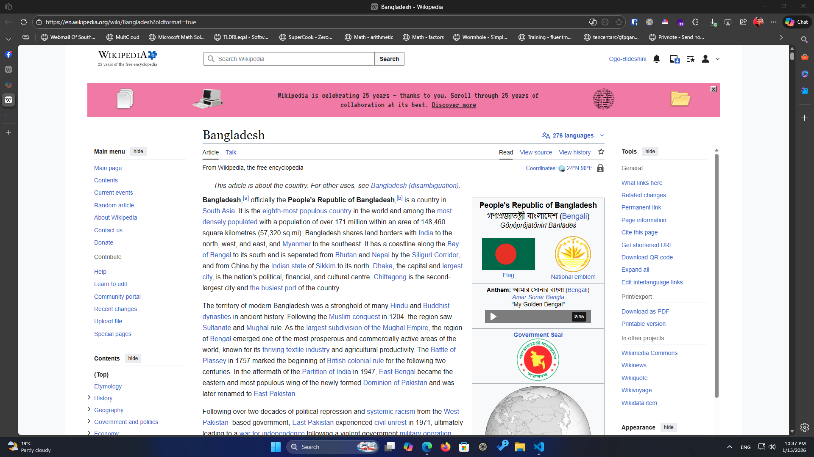
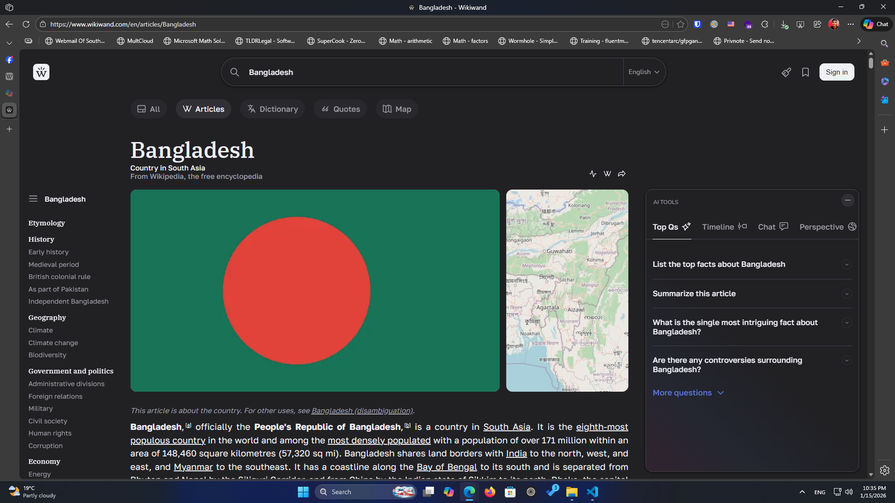

25 years ago, **Wikipedia began as a bold experiment:** could the world’s knowledge be written, edited, and maintained by anyone, anywhere? Today, it stands as one of the most visited websites on the planet, a living encyclopedia that has shaped how billions of people learn, research, and satisfy their curiosity.

Launched in 2001, **Wikipedia** quickly grew from a handful of articles to millions, spanning over 300 languages including my native language বাংলা (Bengali). It became the go-to resource for students, journalists, and everyday learners, offering free access to knowledge that was once locked behind expensive textbooks or subscription services.

In a world where paywalls and advertising have become the norm, **Wikipedia**'s free, reliable knowledge that anyone can access, share and create is more valuable than ever. It remains one of the most-visited websites in the world.

The five pillars of Wikipedia

1. Wikipedia is an encyclopedia

2. Wikipedia is written from a neutral point of view

3. Wikipedia is free content that anyone can use, edit, and distribute

4. Wikipedia's editors should treat each other with respect and civility

5. Wikipedia has no firm rules

Still, **Wikipedia** is confronting a challenging environment. Information integrity is being contested as distrust in media and institutions trends up. **Wikipedia**'s knowledge is also increasingly being used and consumed by generative AI tools, search engines, social media platforms, and other technologies without attribution. That means that while **Wikipedia** continues to be a vital source of trusted information, it's becoming less visible to those who use its content on other websites.

**Wikipedia** will need your continued support as it looks beyond its 25th anniversary. I invite you to read on to learn a little bit about **Wikipedia**, its core values, and the volunteers who write it.

Of course, **Wikipedia** hasn’t been without criticism. Questions of accuracy, vandalism, and bias have followed it since the beginning. Yet its transparent editing history and dedicated community have helped it remain one of the most trusted sources online.

Critics like Elon Musk has publicly accused **Wikipedia** of leaning toward left-leaning or liberal ideologies, framing it as biased against conservatives. He has even announced an alternative project, **Grokipedia**, through his company xAI, which he claims will provide more balanced and context-rich information. However **Grokipedia** is based on xAI's Grok AI model and doesn't possess the same trust as human written community based **Wikipedia**.

**Wikipedia**'s website still runs on MediaWiki, their open source wiki software. It's great but lacks modern UI and features. That's where **Wikiwand** comes in. Wikiwand is a browser extension that modernize the **Wikipedia** user interface and adds helpful AI features that allows you to browse **Wikipedia**.

Wikipedia

Wikiwand

Download [Wikiwand](https://www.wikiwand.com/) now to enhance your **Wikipedia** experience.

Things you can do today to celebrate **Wikipedia's** birthday.

1. Visit their [birthday website](https://wikipedia25.org/).
2. Wish Wikipedia Happy Birthday through [Wikipedia Talk](https://en.wikipedia.org/wiki/Wikipedia_talk:25th_anniversary/Birthday_wishes)
3. Write about **Wikipedia** on your personal website and/or social media.
4. Donate to WikiMedia Foundation
5. Read **Wikipedia**.

If you like **Wikipedia** consider donating to [WikiMedia Foundation](https://donate.wikimedia.org/)
