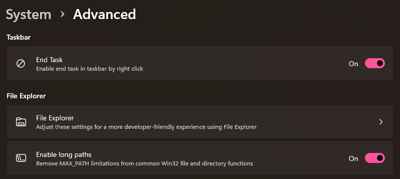
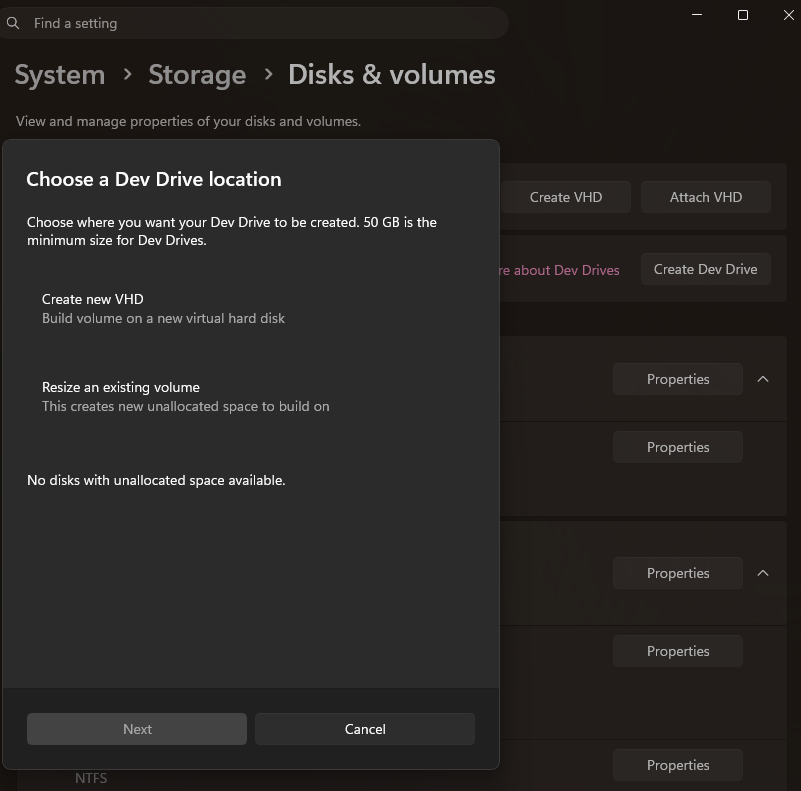
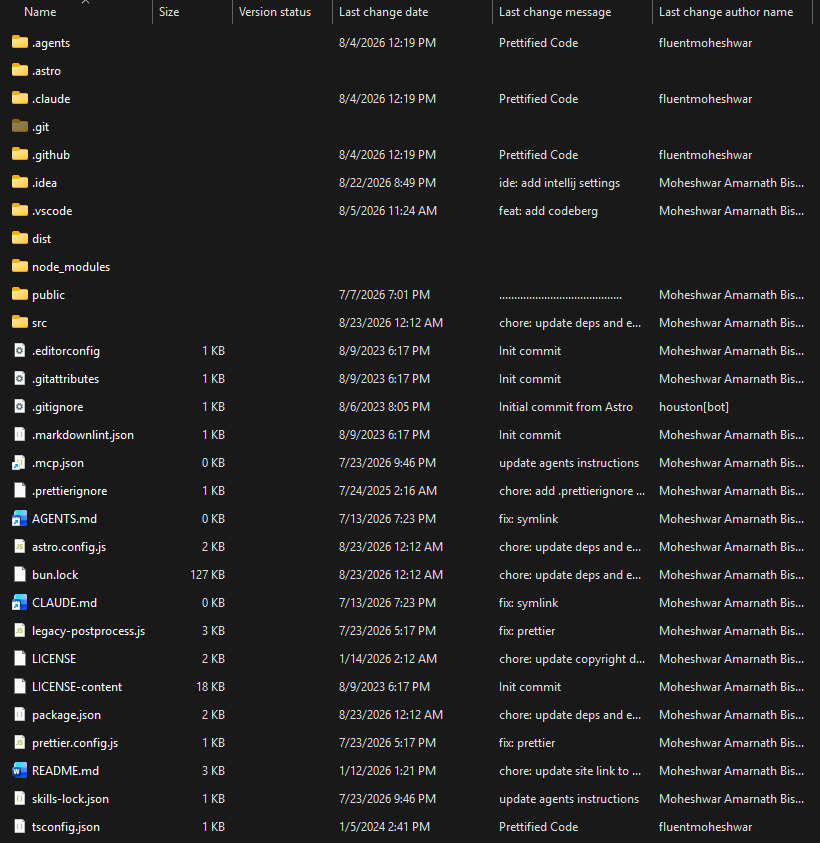
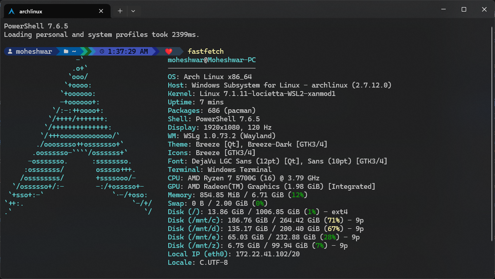
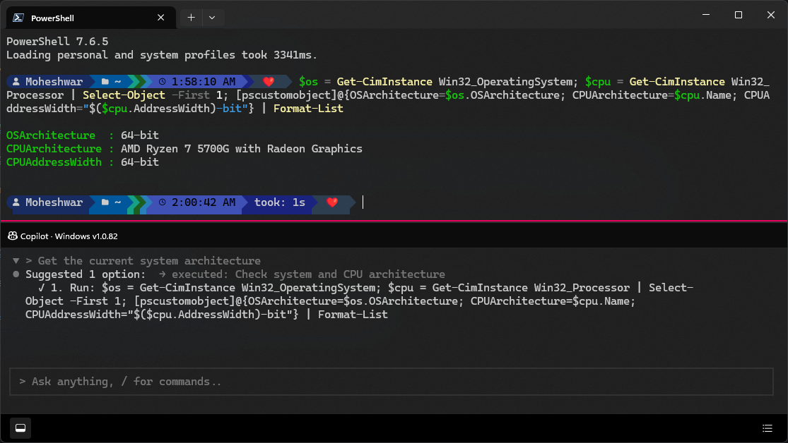

[Microsoft Windows](https://www.microsoft.com/en-us/windows) is the most used operating system in the World. However, when it comes to Software Development the experience is sometimes worse than other Operating Systems such as GNU/Linux or macOS.

Microsoft is constantly working on improving developer experience on Windows to make Windows the platform for developers.

Here are few tips and tricks to improve your development experience on this popular operating system.

## Enable [Long File Paths](https://learn.microsoft.com/en-us/windows/win32/fileio/maximum-file-path-limitation) (Windows 10, version 1607 or later)

Windows restricts the file paths for all applications to 260 characters. However, many development tools and package managers won't work properly without long paths enabled.

To enable long file paths go to Settings (`Win`+`I`) > System > Advanced and toggle the Enable long paths on.



or run this command in PowerShell:

```powershell
New-ItemProperty -Path "HKLM:\SYSTEM\CurrentControlSet\Control\FileSystem" -Name "LongPathsEnabled" -Value 1 -PropertyType DWORD -Force
```

## Create a [Dev Drive](https://learn.microsoft.com/en-us/windows/dev-drive/)

Dev Drive is a new form of storage drive to improve performance for key developer workloads. such as storing third-party libraries, keeping cache, compiling and more.

Benefits of using Dev Drive:

- Uses [ReFS](https://learn.microsoft.com/en-us/windows-server/storage/refs/refs-overview) File System for file system level optimizations such as [block cloning](https://learn.microsoft.com/en-us/windows-server/storage/refs/block-cloning), Sparse VDL, [Integrity Streams](https://learn.microsoft.com/en-us/windows-server/storage/refs/integrity-streams), etc
- Windows Defender scans your repositories asynchronously using [Performance Mode](https://learn.microsoft.com/en-us/defender-endpoint/microsoft-defender-endpoint-antivirus-performance-mode) to reduce performance impact.
- Faster access when working with a lot of small files such as `node_modules`.


To create Dev Drive open Windows Settings (`Win`+`I`) and navigate to System > Storage > Advanced Storage Settings > Disks & volumes. Select Create dev drive.

You will be given three options:

1. Create new VHD - Build volume on a new virtual hard disk
2. Resize an existing volume - Create new unallocated space to build on
3. Unallocated space on disk - Use the unallocated space on an existing disk. *This option will only display if you have previously set up unallocated space in your storage.*



Option 2 and 3 is slightly faster. But 1 is the most convenient. I personally use option 1.

I recommended storing package caches and repositories on dev drive.

To set npm cache to dev drive run this command:

```powershell
mkdir Z:\.cache && npm config set cache "Z:\.cache\npm" # Replace Z: with correct drive letter.
```

To set bun cache to dev drive add this to `%USERPROFILE%\.bunfig.toml`

```toml
[install.cache]
dir = "Z:/.cache/bun"
```

Read <https://learn.microsoft.com/en-us/windows/dev-drive/#storing-package-cache-on-dev-drive> for more information on storing cache.

## Enable [`sudo`](https://learn.microsoft.com/en-us/windows/advanced-settings/sudo/)

To enable Sudo for Windows, open System > Advanced in Windows Settings and set Enable sudo to On.


## [Git in File Explorer](https://learn.microsoft.com/en-us/windows/advanced-settings/fe-version-control)

To enable Git in File Explorer open Windows Settings (`Win`+`I`) and navigate to System > Advanced > File Explorer > Choose Folder and choose your repositories.


Let's see it in action:



## Use [`winget`](https://learn.microsoft.com/en-us/windows/package-manager/winget/) to install apps

`winget` is a built-in Package Manager in Microsoft Windows. You can install apps and development tools using this tool.

Example:

```powershell
winget install Node.js
```

## Install [PowerShell](https://learn.microsoft.com/en-us/powershell/) 7

Windows ships with a very old version of PowerShell by default. The new PowerShell has many new improvements over it, and it's compatible with multiple operating systems.

To install PowerShell you can use winget:

```powershell
winget install Microsoft.PowerShell
```

## Customize your shell

While this is not unique to Windows. You can customize your shell in various different ways, such as using `oh-my-posh`, `starship` and many more.

You can see mine at this URL: <https://moheshwar.com/posts/shellsetup/>

## Install [Windows Subsystem for Linux (WSL)](https://learn.microsoft.com/en-us/windows/wsl/)

WSL is a great option to use Linux utilities without having a Linux VM or changing operating systems. It gives you a full Linux and POSIX compliant (depends on distro) environment inside Windows to work on.

[Ubuntu](https://ubuntu.com) is the default option as a distro when using WSL. However, in my experience Ubuntu isn't the best choice when doing development works as it ships with very old versions of packages.

I prefer [Arch Linux](https://archlinux.org) as my WSL distro.

I recommend following this guide to install Arch Linux in WSL: <https://wiki.archlinux.org/title/Install_Arch_Linux_on_WSL>

I also recommend using [PowerShell-WSL-Interop](https://github.com/mikebattista/PowerShell-WSL-Interop) module in PowerShell to use linux commands directly from PowerShell.

Both [Visual Studio Code (VS Code)](https://code.visualstudio.com) with WSL extension and [JetBrains](https://www.jetbrains.com/ides/) IDEs support WSL properly.



You can also replace sudo with Windows Hello in WSL with [`wsl-hello-sudo`](https://github.com/lzlrd/wsl-hello-sudo)


## Try Intelligent Terminal

Intelligent Terminal is a new Terminal Application for Windows focused on agentic workflow. It can be used with [GitHub Copilot CLI](https://docs.github.com/en/copilot/concepts/agents/copilot-cli/about-copilot-cli) or other AI agents to get AI assistance when working with Terminal or command line interface.

Key features include an agent in a dedicated pane that sees your shell context, catches errors as they happen, and helps you fix them without copy-pasting. Ask it to explain failures, generate commands, or work through multi-step tasks while your shell stays unblocked.




You can get Intelligent Terminal from the [Microsoft Store](https://apps.microsoft.com/detail/9NMQC2SSJX24?hl=en-us&gl=BD&ocid=pdpshare).

## Use Bitwarden as your ssh agent.

While this is not unique to Windows. [Bitwarden](https://bitwarden.com/) is a popular password manager. It can also store ssh keys. Learn more about setting up bitwarden as your ssh agent here: <https://bitwarden.com/help/ssh-agent/>
